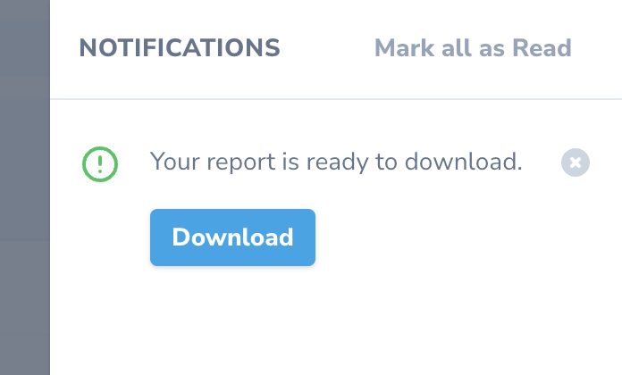

# Notifications

[[toc]]

## Overview

Nova notifications allow you to notify Nova users of events within your application, such as a report being ready to download or of an invoice that needs attention. Nova notifications are displayed within a slide-out menu that can be accessed via the "bell" icon within Nova's top navigation menu.



## Sending Notifications

To send a notification, you simply need to send a `NovaNotification` instance to a user's `notify` method. Of course, before getting started, you should ensure that your user model is [notifiable](https://laravel.com/docs/notifications).

Nova notifications may be generated via the `NovaNotification` class, which provides convenient methods like `message`, `action`, `icon`, and `type`. The currently supported notification types include `success`, `error`, `warning`, and `info`:

```php
use Laravel\Nova\Notifications\NovaNotification;
use Laravel\Nova\URL;

$request->user()->notify(
    NovaNotification::make()
        ->message('Your report is ready to download.')
        ->action('Download', URL::remote('https://example.com/report.pdf'))
        ->icon('download')
        ->type('info')
);
```

You may also send a Nova notification by including the `NovaChannel` in the array of channels returned by a notification's `via` method:

```php
use Laravel\Nova\Notifications\NovaNotification;
use Laravel\Nova\Notifications\NovaChannel;
use Laravel\Nova\URL;

/**
 * Get the notification's delivery channels
 * 
 * @param mixed $notifiable
 * @return array
 */
public function via($notifiable)
{
    return [NovaChannel::class];
}

/**
 * Get the nova representation of the notification
 * 
 * @return array
 */
public function toNova()
{
    return (new NovaNotification)
        ->message('Your report is ready to download.')
        ->action('Download', URL::remote('https://example.com/report.pdf'))
        ->icon('download')
        ->type('info');
}
```

#### Opening Remote Action URLs in New Tabs

When defining a notification action, the `openInNewTab` method may be invoked to instruct Nova to open the given URL in a new browser tab:

```php
->action(
    'Download', URL::remote('https://example.com/report.pdf')
)->openInNewTab()
```

#### Notification Icons

Nova utilizes the free [Heroicons](https://v1.heroicons.com/) icon set by [Steve Schoger](https://twitter.com/steveschoger). Therefore, you may simply specify the name of one of these icons when providing the icon name to the Nova notification's `icon` method.

## Disabling Notifications

If you wish to completely disable notifications inside Nova, you can call the `withoutNotifications` method from your `App/Providers/NovaServiceProvider`: 

```php
use Laravel\Nova\Nova;

/**
 * Boot any application services.
 *
 * @return void
 */
public function boot()
{
    parent::boot();

    Nova::withoutNotificationCenter();
}
```

## Enabling Unread Notifications Count

By default, Nova shows a visual indicator when there are unread notifications inside the notification center. 
If you would like Nova to show the number of unread notifications, you can call the `showUnreadCountOnNotificationCenter` method from your `App/Providers/NovaServiceProvider`: 

```php
use Laravel\Nova\Nova;

/**
 * Boot any application services.
 *
 * @return void
 */
public function boot()
{
    parent::boot();

    Nova::showUnreadCountOnNotificationCenter();
}
```

